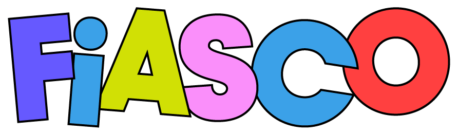

# Fiasco Engine

<p align="center">
  <a href="https://https://void.dev/">
    
  </a>
</p>

<div align="center">
  <a href="#"></a>

  
  
  
  
  
</div>

<!-- Private Repo, so these shields will not dynamically work until public.
<div align="center">
<a href="https://discord.gg/"></a>

<a href="https://github.com/vaguevoid/engine/stargazers"></a>
<a href="https://github.com/vaguevoid/engine/pulls"></a>
<a href="https://github.com/vaguevoid/engine/issues"></a>
<a href="https://github.com/vaguevoid/engine/graphs/contributors">
  
</a>
<a href="https://github.com/vaguevoid/engine/blob/master/LICENSE">
  
</a>
</div>
-->

## 🤖 2D cross-platform game engine
The Fiasco Engine is a free, open source game engine to create high performance,
cross-platform 2D games. This Rust-based, community-driven engine modernizes
game development with powerful, efficient ECS (Entity Component System)
architecture, which more naturally maps game design to game states. Designed
with modularity in mind, the engine is highly extensible, empowering developers
to build custom tools for creative use cases. Games built with the engine can be
easily exported to desktop and web, with mobile and console coming soon.

> [!IMPORTANT] Currently, the Fiasco Engine is in early development. We welcome
> feature suggestions and greatly appreciate bug reports - submit
> [here](https://github.com/vaguevoid/engine/issues)!

<greetings>
<excitement>
<what you can do>

## 🚀 Getting Started

To have a fast, intuitive game development experience, it is highly recommended
to use the **[Fiasco Editor](https://play.void.dev/downloads)** for a graphical
interface. We welcome the use and creation of extensions for both the engine and
the editor. We want our tooling to make game development easy and fun, and we
welcome contributions!

This Rust engine serves as the core foundation for the official [Fiasco
TypeScript SDK](https://github.com/vaguevoid/fiasco), as well as
community-driven SDKs like the [Fiasco C#
SDK](https://github.com/vaguevoid/CS_SDK) and [Fiasco Python
SDK](https://github.com/vaguevoid/python-sdk).

Join the **[Fiasco Dev Discord](placeholder)** for community and support. We
look forward to seeing your games, tools, and engine extensions!

- To create **games**, find tutorials [here](https://docs.void.dev/) and
  examples
  [here](https://docs.void.dev/16b6117901339e9979c10ee2755367bd778bee58/api/).
- To create **custom tooling**, find tutorials [here](https://tools.void.dev/)
  and examples
  [here](https://tools.void.dev/16b6117901339e9979c10ee2755367bd778bee58/examples/load-project).
- To learn more about **engine extensions**, read [here](placeholder).
- To learn about adding a **target platform**, read [here](placeholder)

If you want full control and customization over the engine, you're in the right
place! Press onward to learn more about internal architecture and build from
source.

<where are you coming from>
<what do you want to do>
<how to ask for help along the way>
<where to read docs>
<where to see examples>
<how to add a platform>
<how to add an extension>

## 🧩 Layout of the code

There are subdirectories for:

- [`examples`]
- [`extensions`]
- [`modules`]
- [`platform`]
- [`runtime`]
- [`tools`]

Each directory will have a `README.md` with more details.

A few configuration directories are also included:

- [`.cargo`]
- [`.github`]

Additional folders are creating once the game is built, including:

- [`js`]
- [`target`]


> [!IMPORTANT] **Versioning:** The engine uses commit hashes on the `main`
> branch for versioning. Currently, the only consumers of the engine source code
> reference the repository via Cargo dependencies. This works well with
> commit-based versioning. In the future, when the engine has a wider audience,
> we may transition to [simver](https://simver.org/) or another versioning
> system.

## 🛠️ Building

### Prerequisites
- [Rust](https://www.rust-lang.org/tools/install)
- [Cargo](https://doc.rust-lang.org/cargo/)
- [VS Code](https://code.visualstudio.com/) (Recommended)

### Compiling from Source
1. Clone this repository.
```bash
git clone https://github.com/vaguevoid/engine.git
cd engine
```

2. Run `cargo build` in command line to download dependencies and compile the
   engine source. By default, the output build will be placed in `target/debug`.
   You may add an optional flag `--release` for the output build to be placed in
   `target/release`.
```bash
cargo build [--release]
```

3. Optionally, you may run `cargo clean` to remove all build artifacts in
   `target/` and start afresh anytime.
```bash
cargo clean
```

<build debug>
<build release>
<clean the build>

> [!NOTE] To create and build native modules for the Fiasco engine, use our CLI
> tool [Cargo Fiasco](https://github.com/vaguevoid/cargo-fiasco). Example
> modules include the [Material Editor
> module](https://github.com/vaguevoid/material-editor-module) and [Shader Test
> module](https://github.com/vaguevoid/shader-test-module).

## 📦 Testing

<running tests> To compile your code in test mode, run `cargo test`. Many
optional flags exist to specify a test or feature.

```bash
cargo test [<TEST-NAME>] [--release] [--features <FEATURES>]
```

To add a test, you may add the attribute `#[cfg(test)]` for the module and
`#[test]` for individual test functions in any `.rs` file.
```
// Your Test Module
#[cfg(test)]
mod tests {
    use super::*;

    #[test]
    fn test_add() {
        assert_eq!(add(2, 3), 5);
    }

    #[test]
    fn test_add_negative() {
        assert_eq!(add(-1, -1), -2);
    }
}
```

## ✨ Creating your game

A Fiasco game is made of the following building blocks:
- Platform Executable - *a platform-specific binary to launch the game, with one
  per target platform*
- Runtime - *the core that connects modules to the engine and manages the
  lifecycle*
- Modules - *similar to packages, with at least one module for game content*
- Engine Extensions - *optional dynamic libraries that add platform
  functionality*

<game logic>
<game assets>
<packaging/shipping game>

## 🌐 Support a new platform

Platform-native refers to Windows and MacOS. To support another platform, you
can use the engine API which facilitates platform-specific calls with parameters
passed as flatbuffer events.

*(More information about making platform calls will be updated shortly.)*

<what this means>
<how to do it>

## 🙌 Contributing

<expectations>
<how to contribute>
<some suggested areas of contribution>

## 📃 Licensing

See [`LICENSE.md`]
