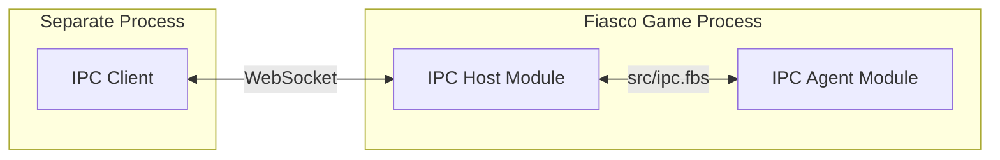

# Inter Process Communication (IPC) module

IPC allows different processes to send and receive messages. The current
implementation uses WebSockets.

## Overview

There are three broad roles defined in this IPC implementation. They are used
heavily in the comments and documentation, so it's helpful to get an
understanding of them.

The pieces are the IPC Client, the IPC Host Module, and the IPC Agent Module(s).



### The IPC Client

The IPC Client is not actually part of this API. Instead, any program using the
WebSockets protocol is a potential IPC Client. There may be any number of
potential clients.

The Fiasco Editor running in a browser is an example of an IPC Client. It
doesn't (and doesn't need to) use this library directly.

Note: (This may make more sense as you read further) The IPC Client does not
make direct use of the [`src/ipc.fbs`] schema. The client and agent should
develop their own schema which they communicate with.

### IPC Host Module

This library is largely this piece. It's a Fiasco game module which listens on a
TCP/IP port for a WebSocket connection and negotiates that protocol for IPC
Agent Modules.

There is only expected to be a single IPC Host Module running in a given game
since it can handle multiple clients and agents (see below).

### IPC Agent Module

The IPC Agent Module (or modules, there may be any number of them) makes use of
the [`src/ipc.fbs`] schema for communication to/from the IPC Host Module, but is
otherwise separate.

The agent is where your programming comes in. Are you creating something for a
game editor, performance, telemetry gathering, game debugger as a separate
process? If so, you may implement that as an IPC Agent Module.

Note: As mentioned in 'The IPC Client' section, the [`src/ipc.fbs`] schema is
*only* used to communicate with the IPC Host Module. You'll want to define a
separate list of messages (a schema) which the agent and the client use (which
is opaque to the IPC Host Module).

## Building

This module requires the `flatc` flatbuffers compiler on the $PATH during build
time (only, this is not a run-time requirement). Be sure to verify that
compatible versions are used for each module accessing the same flatbuffers
formatted data and the flatbuffers libraries in use (it is easiest to simply use
the same version). Tip: `flatc --version` will output version information for
the `flatc` compiler.

The flatbuffers compiler also includes options on how data is written and read
(how utf8 is handled for example). This is not a primer on flatbuffers, but
merely some advice on things to watch for.

## Running

There are not any special run-time requirements (i.e. external programs or
libraries). Though the user will need to have OS permission to open a socket at
the given port number (specified by the game). Note: An operating systems (OS)
may put user (permission) restrictions on some port numbers.

## Usage

To use IPC both an IPC Client (using the terms defined above) and IPC Agent will
need to be created. This module provides (only) the IPC Host module.

### Client

If the client were a browser or something in JavaScript, the IPC Client might
resemble the following. This is intended convey a rough idea, it's not a how-to
on writing a WebSocket client.

```javascript
const socket = new WebSocket('ws://127.0.0.1:9001');
socket.binaryType = 'arraybuffer';

socket.onopen = () => {
  ...
};
socket.onmessage = (event) => {
  const data = new DataView(event.data);
  ...
};
socket.onclose = () => {
  ...
};
socket.onerror = (error) => {
  ...
};
```

A more complete example is in [`../../examples/ipc_agent/web_root/websocket_example.js`].

### Agent

If the IPC agent, as a game module, were written in Rust, it might have a system
such as:

```rust
#[system]
fn handle_message_events(
    reader: EventReader<MessageFromRemote<'_>>,
    writer: EventWriter<MessageToRemote<'_>>,
) {
    for event in &reader {
        // Be sure to check that this message is on a channel this agent is
        // interested in.
        ...
        // Maybe write something back.
        writer.write_builder(|builder| {
            let content_offset = builder.create_vector(content);
            MessageToRemote::create(
                builder,
                &MessageToRemoteArgs {
                    channel: my_channel_number,
                    content: Some(content_offset),
                },
            )
        });
        ...
    }
}
```

A more complete example is in [`../../examples/ipc_agent/src/lib.rs`].

### Protocol

The game using this module may act as a host which listens for incoming
WebSocket connections.

For details, see the doc comments in the "./src/ipc.fbs" file herein.

## Limitations

Outbound connections (where the game acts as a client, reaching out to a
WebSockets host) are not yet supported. Support for outbound connections could
be added (it hasn't been requested yet).

Security (such as TLS) has not yet been added. Some (possibly remote) process
could unexpectedly connect to opened ports if the firewall allows (e.g. the OS
firewall; there's not firewall in this module).
